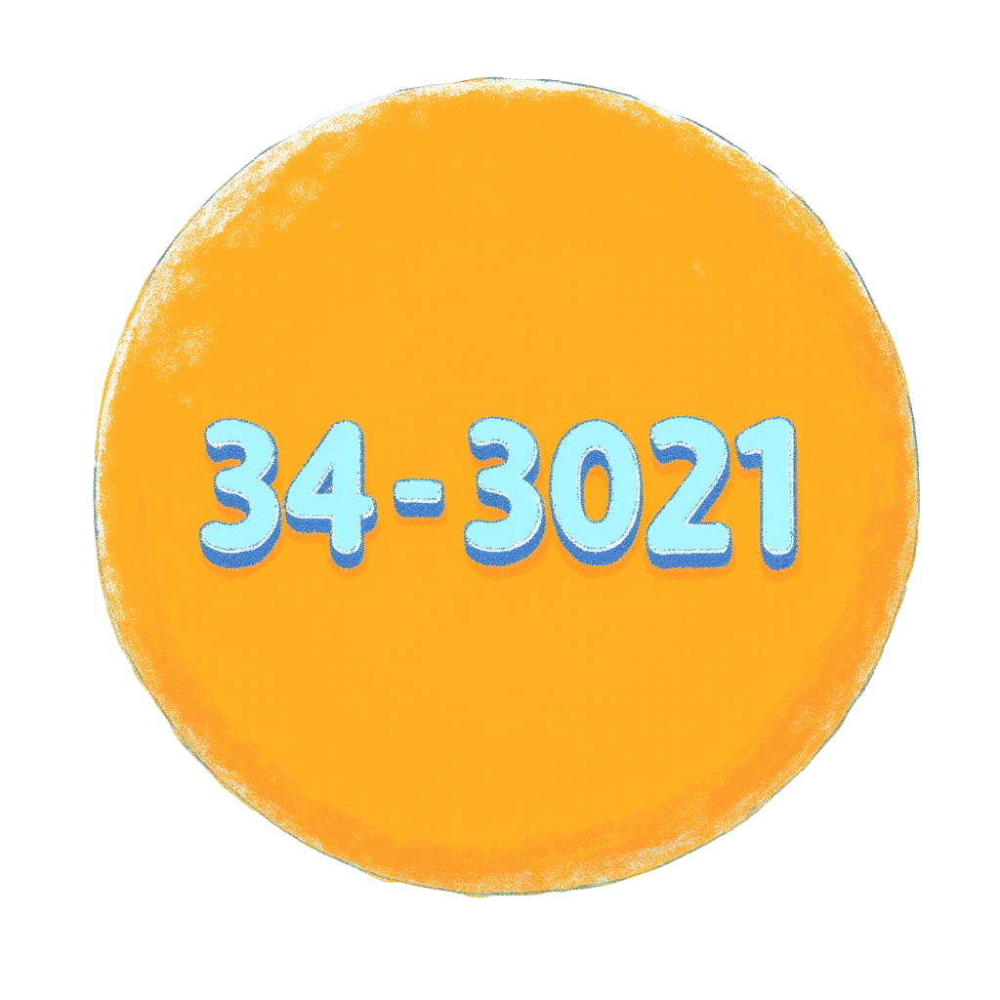
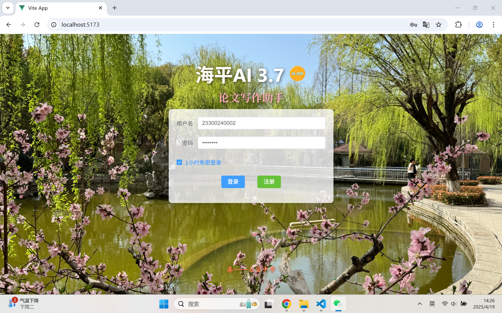
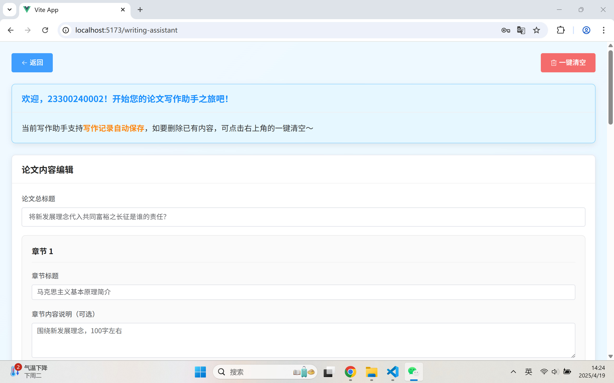
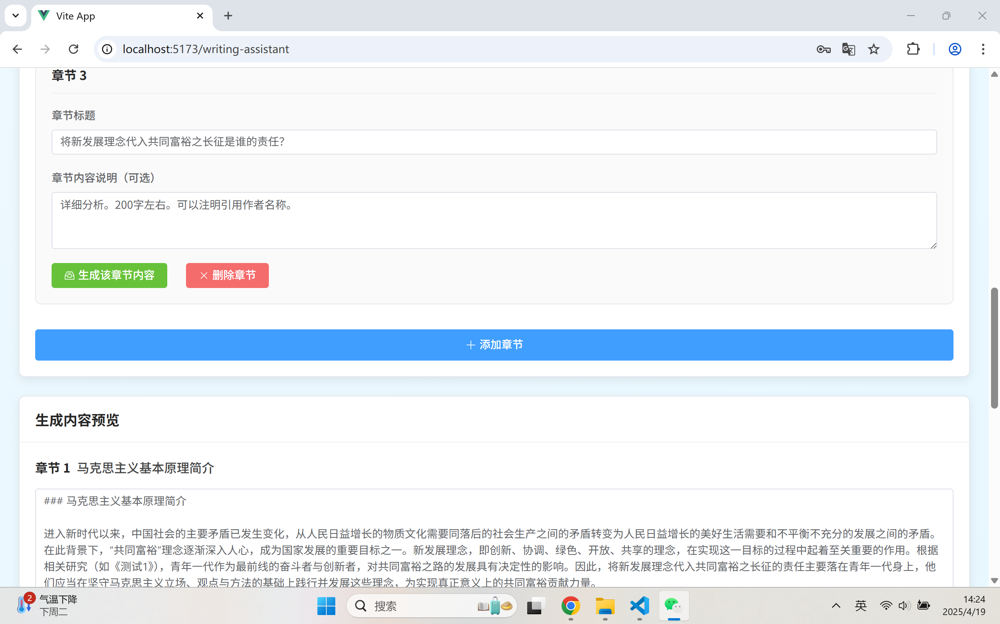
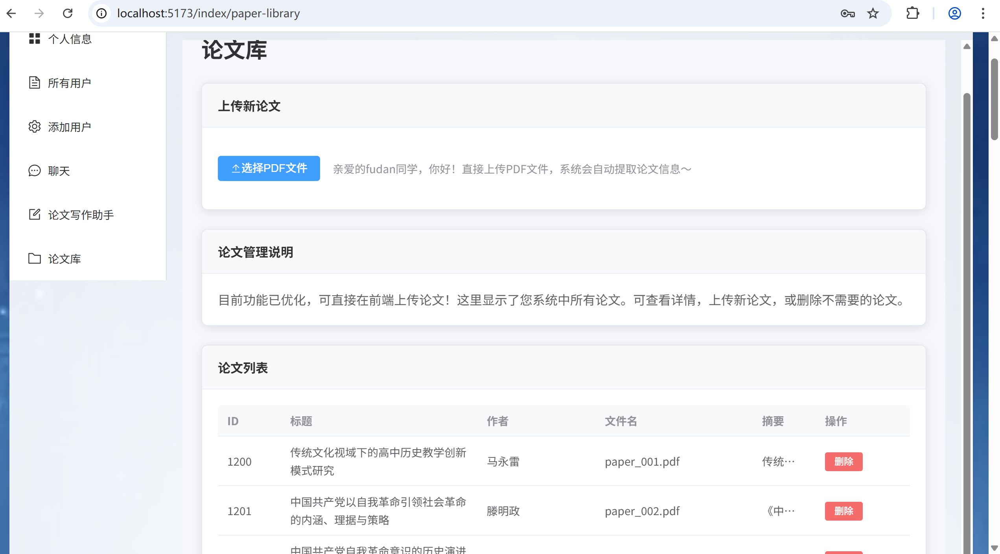
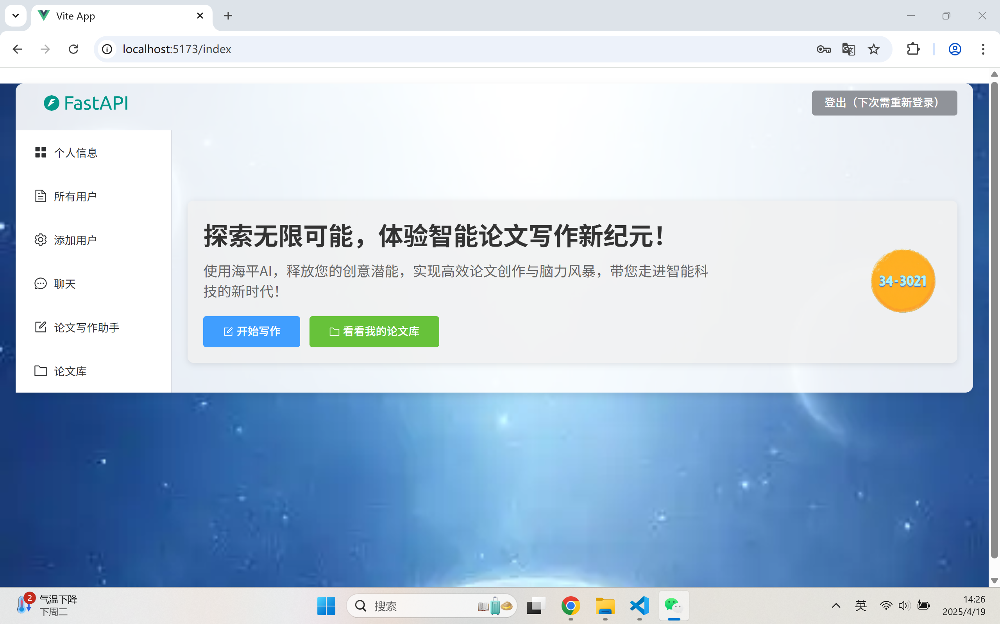
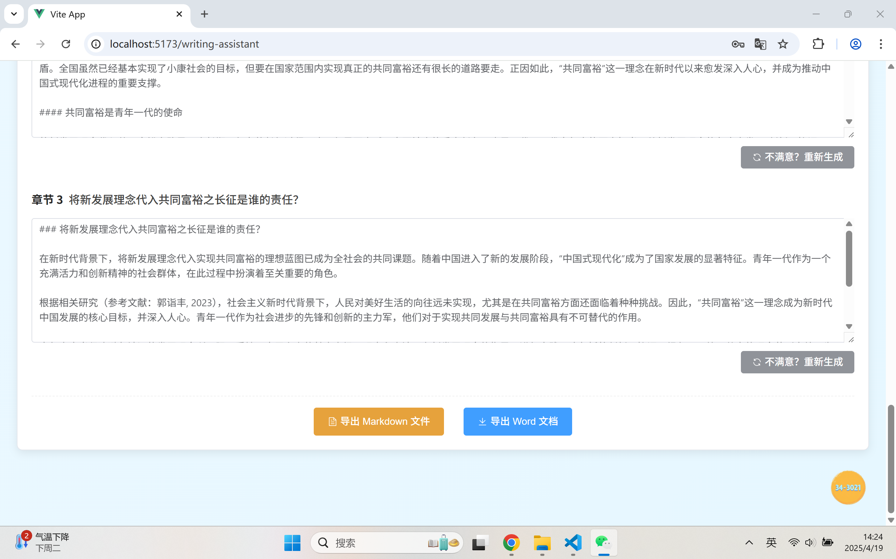
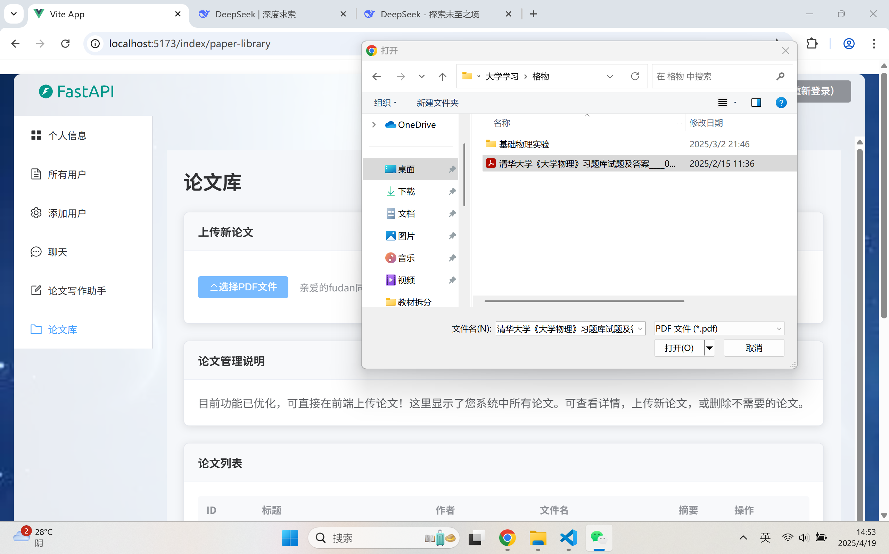
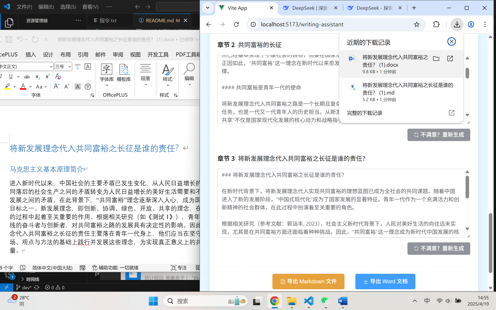
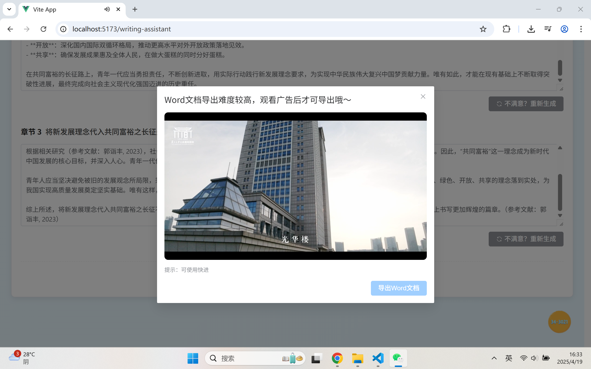

# AI论文写作助手系统

由“34-3021寝室”集团有限公司中的郭诣丰开发
商标：


## 一、项目简介

AI论文写作助手系统是一个基于大语言模型的智能论文写作平台，采用前端（Vue）、后端业务（FastAPI）、后端算法（FastAPI+向量数据库）三层架构。系统支持论文智能生成、分章节管理、论文库上传与检索、会话保存、免密登录、文档导出等功能，极大提升学术写作效率。

-  

---

## 二、功能概述

- **用户注册与登录**（含一小时免密登录）
- **论文写作助手**（AI驱动，分章节生成）
- **论文库管理**（PDF上传、摘要展示、删除）
- **写作记录自动保存与恢复**
- **章节内容不满意可重新生成**
- **导出Word/Markdown文档**
- **前端美化与品牌设计**

---

## 三、技术栈

- **前端**：Vue3、TypeScript、Element Plus、Pinia、Axios
- **后端业务层**：FastAPI、SQLAlchemy、PyJWT
- **后端算法层**：FastAPI、大语言模型API、Chroma向量数据库
- **数据库**：MySQL、Chroma

---

## 四、项目结构

```
mysql_fastapi_vue_sample_project/
├── frontend/           # 前端Vue项目
├── backend/            # 后端业务层
├── backend_algo/       # 后端算法层
├── data_vector_db/     # 向量数据库（Chroma相关文件）
├── eval_results/       # 评测结果导出目录（如BERTScore、ROUGE等自动评测结果）
├── papers/             # 数据集文件夹，包含论文与所有问题（含mapping.csv、questions.json、questions.txt等）
├── tools/              # 工具脚本文件夹（如download_model.py等辅助脚本）
├── workspace/          # AI生成内容与评测结果自动保存目录
├── 指令.txt            # 启动与常用操作指令说明
└── README.md           # 本说明文档
```

---

## 五、安装与运行方法

具体方法已经在**readme**中进行了详细说明，这里不再赘述。

---

## 六、我的新增与特色功能说明

### 1. 论文写作助手（WritingAssistant.vue）

- **功能描述**：用户输入论文总标题和各章节标题/指引，系统通过前后端交互，调用助教提供的AI API，结合数据库检索相关论文内容，自动生成高质量学术文本。
- **实现方式**：前端收集用户输入，调用后端业务接口，后端业务层调用算法层API，算法层检索向量数据库并生成内容，最终返回前端展示。
- 具体来说，前端通过 WritingAssistant.vue 收集用户输入的论文总标题、章节标题和指引，点击按钮后调用 GenerateChapterApi（定义于 api.ts），向后端 /api/generate-chapter 接口发送请求。后端业务层（backend/main.py）接收到请求后，先用 search_similar_papers（backend_algo/retrieval.py）检索相关论文，再拼接向量化信息和用户输入，构造最终 prompt。随后，我们就可以通过 HTTP 请求调用算法层 /chat/generate-chapter（backend_algo/main.py），由大模型生成章节内容，最后将结果返回前端并展示在页面。

### 2. 分章节生成与章节管理

- **功能描述**：支持最多5个章节，用户可动态添加/删除章节，每章可单独设置生成指引和内容。
- **实现方式**：前端用响应式数组管理章节，提供添加/删除按钮，生成内容时逐章调用API，内容实时保存。
- 具体来说，前端在 WritingAssistant.vue 中用响应式数组 chapters 管理所有章节，用户可通过“添加章节”按钮动态增加章节（这里最多只允许5个，当然可以，随时修改为更多），每章有独立的标题、指引和内容输入框。每个章节的“生成内容”按钮会调用 generateChapterContent 方法，单独向后端请求生成内容。章节的添加、删除、内容编辑等操作均通过 Vue 的响应式机制实时更新，最后，自动保存到 localStorage。

### 3. 一小时免密登录

- **功能描述**：登录后可选择一小时内免密自动登录，提升体验且安全。
- **实现方式**：登录成功后将JWT Token和时间戳存入localStorage，进入页面时自动校验有效期。主动登出则需重新登录，直接关闭网页后可自动进入主页。token 的加入避免了直接保存用户账号、密码的危险可能，非常安全。（感谢室友在此处的提醒，否则就要巨大风险了）
- 具体来说，登录表单组件（frontend/src/components/LoginForm.vue）在用户登录成功后，将用户名、token、时间戳等信息存入 localStorage（键名为 loginInfo），并在勾选“1小时免密登录”时生效。每次进入系统时，frontend/src/main.ts 会自动检测 localStorage 中的 token 是否在有效期内且未手动登出，若满足条件则自动填充用户信息并跳转主页。登出时（frontend/src/components/Header.vue），会将 manualLogout 标记为 true，确保下次访问需重新登录。

### 4. 论文库展示与管理（PaperLibrary.vue）

- **功能描述**：展示当前论文库，支持上传本地PDF论文，自动解析并展示来源、摘要，支持前端直接删除。
- **实现方式**：前端文件上传，后端解析PDF并存入数据库及向量库，前端通过API获取论文列表并渲染，支持删除操作。
- 具体来说，前端 PaperLibrary.vue 提供上传按钮，用户选择PDF后通过 fetch API 发送带有token的POST请求到 /api/papers/upload，后端业务层（backend/main.py）解析PDF内容，提取标题、作者、摘要，并存入数据库。上传后自动触发向量化线程，将论文内容写入Chroma向量数据库。前端通过 GetPapersList API 获取论文列表，渲染为表格，支持一键删除（调用 DeletePaper API），所有操作都有友好提示。

### 5. 写作助手自动保存与恢复

- **功能描述**：写作内容和历史聊天记录自动保存到本地，除非用户点击“一键清空”，否则内容始终保留。
- **实现方式**：前端用watch监听数据变化，实时存储到localStorage，onMounted时自动恢复。
- 具体来说，在 WritingAssistant.vue 中，使用 Vue 的 watch 深度监听 mainTitle 和 chapters 的变化，每次变动时自动调用 saveToLocalStorage 方法，将当前写作状态序列化存储到 localStorage。组件挂载时（onMounted），自动调用 loadFromLocalStorage 恢复上次写作内容。点击“一键清空”按钮会弹出确认框，确认后清除 localStorage 并重置页面数据，这可以确保数据安全，且用户体验良好。

### 6. “不满意？重新生成”

- **功能描述**：对任意章节内容不满意时，可一键重新生成，并可修改生成要求。
- **实现方式**：每个章节内容区域下方有“重新生成”按钮，点击后会调用 regenerateChapterContent 方法，先清空当前章节内容，再重新调用 generateChapterContent 发送API请求。用户可在重新生成前修改章节指引，生成的新内容会覆盖原有内容。该功能通过前端的事件绑定和API交互实现，保证操作便捷且响应及时。

### 7. 导出Word和Markdown文档

- **功能描述**：支持将AI生成内容导出为Markdown和Word格式，便于后续编辑与分享。
- **实现方式**：前端集成`file-saver`和`docx`库（见 package.json 和 document-formatter.ts），点击“导出”按钮时，分别调用 generateMarkdownDocument 和 generateWordDocument 方法，将所有章节内容拼接为Markdown或Word格式。由于所用的API的AI导出格式默认为Markdown，因此Markdown可以直接导出；但对于Word，需要额外处理。具体来说，编写了一个函数来专门将Markdown内容解析为段落、标题等格式，自动处理粗体、字号等样式，如此就能得到一个 .docx 文件供用户下载。

### 8. 前端美化与品牌设计

- **功能描述**：整体风格清新明快，圆角、按钮等样式统一，覆盖element-plus默认样式，加入寝室自制trademark图标和宣传语“探索无限可能，体验智能论文写作新纪元！”，等等。
- **实现方式**：前端大量使用自定义CSS和Element Plus组件，统一圆角、阴影、配色等风格（如 .content-card、.welcome-card、.chapter-box 等类）。通过 :deep 选择器（如 :deep(.el-card__header)）覆盖Element Plus默认样式，实现更符合品牌的UI效果。品牌图标（trademark.jpg）在首页、登录、注册、写作助手等页面均有展示，并配合宣传语“探索无限可能，体验智能论文写作新纪元！”。背景图、渐变色、按钮样式则均在各页面的 style scoped 中详细定制。

---

## 七、界面展示

-   
  *论文写作助手主界面*

-   
  *论文写作助手主界面*


-   
  *论文库管理界面*


-   
  *首页美化与品牌展示*


-   
  *导出Word/Markdown功能界面*


-   
  *用户可便捷实现上传*

-   
  *用户可便捷实现下载*


-   
  *后续可广告商业化，目前采用剪辑后复旦大学宣传视频*

---

## 八、注意事项

1. 各部分启动顺序不可颠倒，建议严格按“指令.txt”操作。
2. 需保证MySQL和Chroma数据库均已启动。
3. 首次使用请先注册账号。
4. 论文库和写作内容均可自动保存，建议定期导出备份。

---

## 九、开发者与致谢

本项目由“34-3021寝室”集团有限公司中的郭诣丰开发，作为数据库引论课程项目。  
感谢老师、二位助教与开源社区（34-3021寝室）的支持。
欲商业化项目，请先给分满分，随后联系电话19945700324（郭诣丰）。

---

## 十、许可证

本项目采用 “34-3021寝室-MIT” 许可证开源。
