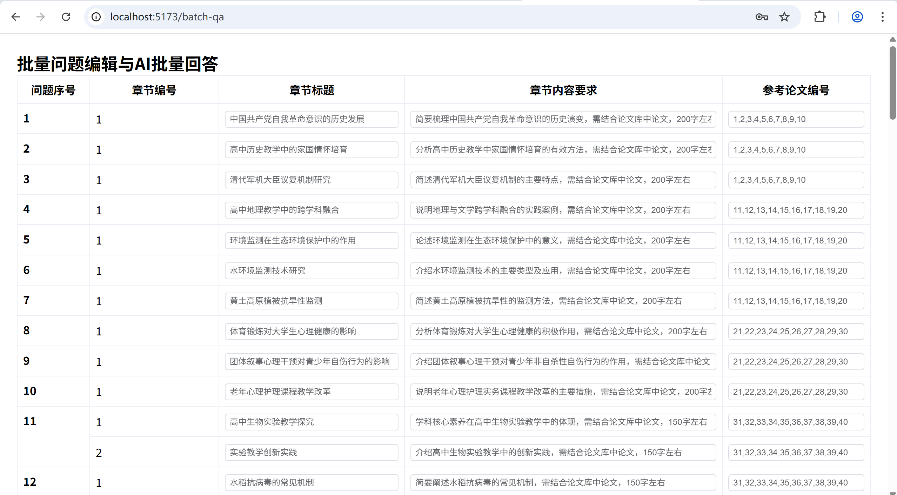
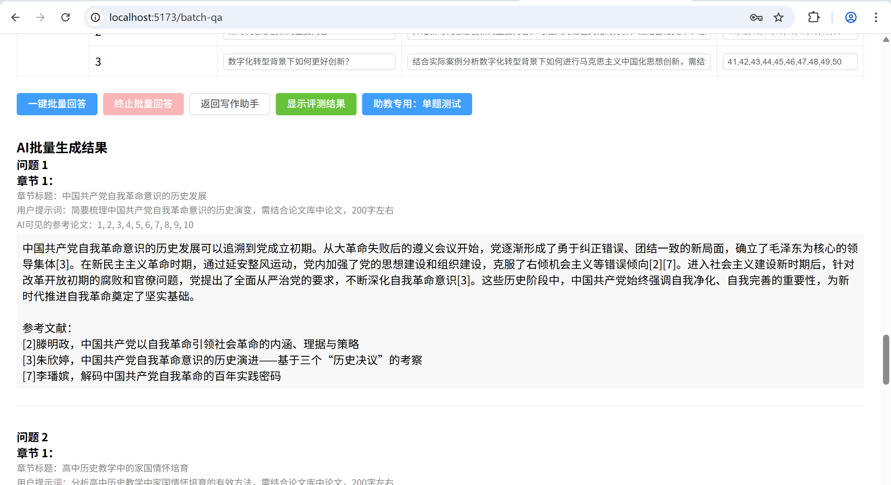
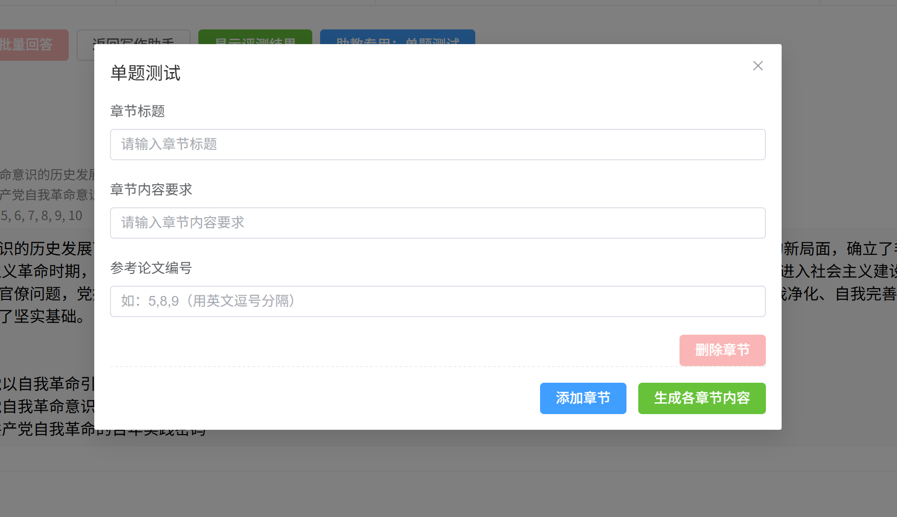
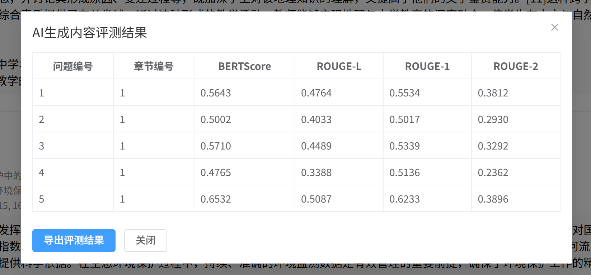

# AI论文写作助手系统 报告

由“34-3021寝室”集团有限公司中的郭诣丰开发
商标：


## 一、项目简介

AI论文写作助手系统是一个基于大语言模型的智能论文写作平台，采用前端（Vue）、后端业务（FastAPI）、后端算法（FastAPI+向量数据库）三层架构。系统支持论文智能生成、分章节管理、论文库上传与检索、会话保存、免密登录、文档导出、批量问题自动生成与评测等功能，极大提升学术写作效率。

-  

---

## 二、功能概述

- **用户注册与登录**（含一小时免密登录）
- **论文写作助手**（AI驱动，分章节生成）
- **论文库管理**（PDF上传、摘要展示、删除）
- **写作记录自动保存与恢复**
- **章节内容不满意可重新生成**
- **导出Word/Markdown文档**
- **前端美化与品牌设计**
- **批量问题编辑与AI批量回答**：支持在BatchQA页面一键批量生成所有questions.json中的问题答案，用户可在前端页面清晰查看、随时修改问题与参考论文编号，并直接看到AI的批量回答结果，界面美观直观。
- **单题测试功能**：在批量回答界面，支持助教专用的单题测试弹窗，用户可自定义输入章节标题、内容要求和参考论文编号，进行单个问题的AI写作测试，便于灵活测试和现场演示。
- **自动评测与导出**：AI批量生成后，前端可一键点击“显示评测结果”，自动对每个问题的AI答案与标准答案进行BERTScore、ROUGE等多指标评测，并可直接导出为CSV文件，便于分析和对比。
- **论文库与问题集扩展**：系统支持大规模论文库（50+篇，涵盖心理学、生命科学、地理、历史、马克思主义等多个领域），问题集支持自定义设计，便于多场景测试和评测。

---

## 三、技术栈

- **前端**：Vue3、TypeScript、Element Plus、Pinia、Axios
- **后端业务层**：FastAPI、SQLAlchemy、PyJWT、Pandas、PyPDF2、pdfminer.six、jieba、bert-score、rouge-chinese、tiktoken、openpyxl、python-docx等
- **后端算法层**：FastAPI、transformers、torch、sentence-transformers、Chroma向量数据库、BGE-Reranker、numpy、requests等
- **数据库**：MySQL、Chroma
- **评测工具**：BERTScore、ROUGE
- **辅助工具**：openpyxl、python-dotenv、tqdm等

---

## 四、项目结构

```
mysql_fastapi_vue_sample_project/
├── frontend/           # 前端Vue项目
├── backend/            # 后端业务层
├── backend_algo/       # 后端算法层
├── data_vector_db/     # 向量数据库（Chroma相关文件）
├── eval_results/       # 评测结果导出目录（如BERTScore、ROUGE等自动评测结果）
├── papers/             # 数据集文件夹，包含论文与所有问题（含mapping.csv、questions.json、questions.txt等）
├── tools/              # 工具脚本文件夹（如download_model.py等辅助脚本）
├── workspace/          # AI生成内容与评测结果自动保存目录
├── 指令.txt            # 启动与常用操作指令说明
└── README.md           # 运行说明文档
```

---

## 五、安装与运行方法

详见**README.md**，包含依赖安装、数据库配置、各层启动顺序、论文导入与批量生成等详细说明。

---

## 六、我的新增与特色功能说明

### 1. 期中前的工作：论文写作助手（WritingAssistant.vue）

- 用户注册与登录：实现了基于FastAPI和JWT的用户注册、登录、会话管理，支持一小时免密登录，提升用户体验。
- 论文写作助手（分章节生成）：前端WritingAssistant.vue页面支持用户输入论文总标题、多个章节标题与内容要求，后端业务层（backend/main.py）接收请求，调用算法层大模型接口，自动生成每个章节的学术内容。
- 论文库管理：支持PDF论文上传（自动解析内容、提取摘要、自动向量化）、摘要展示、论文删除（同步删除数据库和向量库），所有操作均可在前端PaperLibrary页面完成。
- 写作记录自动保存与恢复：前端自动将用户输入的写作内容、章节结构等保存到localStorage，刷新页面或意外关闭后可自动恢复，防止数据丢失。
- 章节内容不满意可重新生成：用户可对任意章节内容一键重新生成，后端自动重新调用AI接口，提升写作灵活性。
- 导出Word/Markdown文档：支持一键导出写作结果为Word或Markdown格式，便于后续编辑与提交。
- 前端美化与品牌设计：整体UI采用Element Plus美化，首页、登录页、论文库等均有品牌标识和复旦广告视频。
- 论文内容分段展示与编辑：每个章节内容可单独编辑、预览和导出，支持多章节并行写作。

### 2. 批量问题编辑与AI批量回答（BatchQA.vue）

- 批量编辑与一键生成：前端BatchQA.vue页面支持批量加载questions.json中的所有问题，用户可在表格中直接编辑每个章节的标题、内容要求和参考论文编号（R字段），并一键批量生成所有问题的AI答案。
- 实时进度与终止功能：批量生成过程中，前端实时显示进度百分比，支持随时终止批量生成，防止误操作或长时间等待。
- 结果展示与溯源：所有AI生成结果按问题和章节分组展示，用户可清晰查看每个问题的AI答案、参考论文编号和用户提示词，便于溯源和对比。
- 自动保存与导出：批量生成结果自动保存到workspace目录，便于后续评测和复查。

### 3.  单题测试功能

- 弹窗式单题测试：在BatchQA页面新增“助教专用：单题测试”按钮，点击后弹出对话框，用户可自定义输入章节标题、内容要求和参考论文编号（支持多个章节），并一键生成AI答案。
- 多章节支持：弹窗内支持添加、删除多个章节，便于灵活测试不同场景下的AI写作能力。
- 结果即时展示：生成结果在弹窗内即时展示，便于现场演示和快速验证AI效果。

### 4. 自动评测与导出

- 一键评测：批量生成后，前端可一键点击“显示评测结果”，自动调用后端/evaluate-batch-generate接口，对每个问题的AI答案与标准答案进行BERTScore、ROUGE等多指标评测。
- 多维度指标：评测结果包括BERTScore、ROUGE-L、ROUGE-1、ROUGE-2等，全面反映AI生成内容与标准答案的相似度和覆盖度。
- 结果导出：评测结果可一键导出为CSV文件，便于后续分析、对比和展示。
- 评测结果可视化：前端表格清晰展示每个问题、每个章节的各项评测分数，便于定位AI表现优劣。
  
### 5. 论文库与问题集扩展
- 大规模论文库支持：系统支持50+篇论文的管理与检索，涵盖心理学、生命科学、地理、历史、马克思主义等多个领域，便于多场景测试。
- 问题集自定义与扩展：所有问题均存放于questions.json和questions.txt，支持用户自定义设计和批量导入，便于灵活扩展测试集。
- 论文编号与文件映射：通过mapping.csv实现论文编号与文件名的自动映射，保证引用编号与实际论文一一对应。

---

## 七、数据集与问题集

- 论文数据集全部来自知网，存放于papers文件夹，涵盖心理学、生命科学、地理、历史、马克思主义等五大领域，每个领域10篇，共50篇论文。论文内容覆盖面广，且同一主题下有多篇论文存在相似内容（如心理健康、肠道微生物、地理教学等主题下均有多篇论文），便于测试AI在相似论文中筛选最优引用的能力。
- 问题集由个人精心设计，存放于questions.json和questions.txt，每个问题（Q）都配有参考论文编号（R），标准答案（A）则由本人结合deepseek、copilot等AI工具协助生成，并人工调整优化，确保答案的合理性和针对性。这样设计便于系统性评测AI的引用准确性和内容质量。

---

## 八、核心算法

PJ在论文检索与AI写作环节采用了多项先进算法，确保生成内容的相关性、权威性和可控性，具体包括：

1. 召回+重排序双阶段检索架构
- 召回阶段：在main.py的批量生成接口中，首先利用Chroma向量数据库（retrieval.py）对用户输入的章节标题和内容要求进行向量化检索。通过search_similar_papers函数，在论文库中高效召回与问题最相关的论文（如top10）。
- 重排序阶段：对召回的候选论文，调用算法层的/v1/rerank接口，使用BGE-Reranker模型（main.py）对(query, doc)对进行语义相关性打分，返回top3最相关论文。该模型基于transformers和torch，支持本地离线推理，保证高效和准确。
- 代码实现：召回与重排序流程在main.py的batch_generate接口中实现，先召回topN，再重排序top3，最后将编号传递给AI写作prompt，严格限定引用范围。

2. 严格限定AI引用范围，防止“走偏”
- Prompt控制：在AI写作prompt中明确要求“只允许引用以下编号，严禁出现其它编号或引用”，并对引用格式做出详细规范（如只能用[编号]，不能用“见论文[14]”等）。
- 正则清洗与后处理：通过clean_references函数，对AI生成内容进行正则处理，自动剔除不合规引用、去除多余参考文献部分、统一引用格式，保证输出结果与指定论文强相关。
- 引用编号与论文一一对应：通过mapping.csv和数据库查询，确保每个引用编号都能准确定位到对应论文，防止编号错乱或引用失效。

3. 论文库的自动向量化与同步管理
- 自动向量化：论文上传后，后端自动调用vectorizer.py和retrieval.py，将论文内容向量化并写入Chroma数据库，支持高效检索。
- 异步处理：向量化过程采用线程异步处理，避免阻塞用户上传操作，提升系统响应速度。
- 同步删除与清理：论文删除时，自动同步删除数据库和向量库中的对应记录，支持一键清空、批量清理“僵尸”向量等维护操作，保证数据一致性。
- 批量导入与向量化：支持通过脚本批量导入论文并自动向量化，便于大规模数据集的初始化和扩展。

4. 批量生成与单题测试的灵活支持
- 批量生成：支持批量编辑所有问题，自动按章节、按问题批量生成AI答案，极大提升测试与评测效率。
- 单题测试：支持弹窗式单题测试，用户可自定义输入章节标题、内容要求和参考论文编号，灵活测试AI写作能力。
- 自动保存与溯源：所有生成结果自动保存到workspace目录，便于后续评测、复查和结果溯源。

5. 自动评测与多指标评价体系
- BERTScore评测：后端集成bert-score库，自动计算AI生成内容与标准答案的BERTScore（P、R、F1），衡量语义相似度和内容覆盖度。
- ROUGE评测：集成rouge-chinese库，自动计算ROUGE-L、ROUGE-1、ROUGE-2等指标，衡量生成内容与标准答案的n-gram重叠度。
- 分词与清洗：评测前对文本进行jieba分词和正则清洗，保证评测结果的准确性和可比性。
- 评测结果导出：所有评测结果可一键导出为CSV文件，便于后续分析、对比和展示。
- 代码实现：评测流程在main.py的evaluate-batch-generate接口中实现，支持批量评测和结果可视化。

## 九、评测结果

最终评测结果可见项目下的eval_results下的csv文件，记录了50个问题的各项指标得分与平均值。bert-score达到0.6左右；ROUGE得分也基本在0.4以上。AI的回答比较优秀。

## 十、界面展示

-   
  *论文写作助手主界面*

-   
  *论文写作助手主界面*

-   
  *论文库管理界面*

-   
  *导出Word/Markdown功能界面*

-   
  *用户可便捷实现上传*

-   
  *用户可便捷实现下载*

-   
  *后续可广告商业化，目前采用剪辑后复旦大学宣传视频*

-   
  *批量写作页面*

-   
  *批量写作页面*

-   
  *单题测试弹窗*

-   
  *写作指标评价*

---

## 十一、开发者与致谢

目前最终代码已经上传到github。（账号为学号）
本项目由“34-3021寝室”集团有限公司中的郭诣丰开发，作为数据库引论课程项目。  
感谢老师、二位助教与开源社区（34-3021寝室）的支持。
欲商业化项目，请电话19945700324（郭诣丰）。

---

## 十二、许可证

本项目采用 “34-3021寝室-MIT” 许可证开源。
